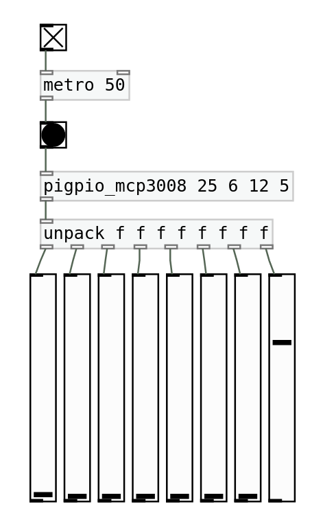

# pigpio_mcp3008
Raspberry Pi PureData external to read analog values from an [MCP3008](https://www.microchip.com/en-us/product/MCP3008) connected to the Pi's GPIO. 

`pigpio_mcp3008` uses [pigpio](https://abyz.me.uk/rpi/pigpio/) with bit bashing. Bit bashing allows more than two SPI devices to be connected using arbitrary CS pins. If multiple MCP3008 devices are used, they can share the same MISO, MOSI and
SCLK and have different CS lines. 

# Prerequisites

[pigpio](https://abyz.me.uk/rpi/pigpio/) is required in order to run this external. Additionally, PureData needs to be run as root.

# Usage

The repository comes with a precompiled PureData external. To use it, clone this repository and add its path to PureData (File -> Preferences -> Path...)

The object's name is `pigpio_mcp3008`; right-click and select Help for usage instructions.

Usage: `pigpio_mcp3008 cs miso mosi sclk`

For example, for CS on GPIO 25, MISO on GPIO 6, MOSI on GPIO 12 and SCLK on GPIO 5, the command will be `pigpio_mcp3008 25 6 12 5`

Note that SPI is enabled on the first bang.

