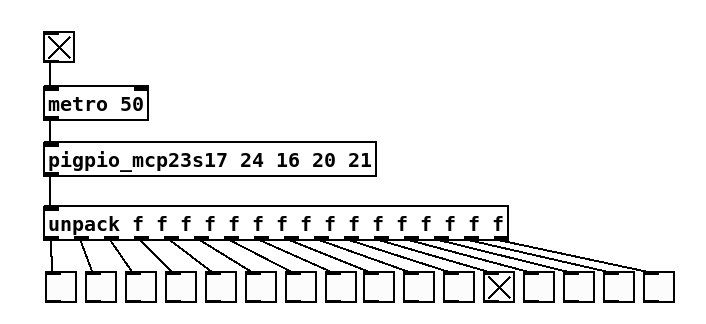

# pigpio_mcp23s17
Raspberry Pi [PureData](https://puredata.info/) external to read values from a [MCP23S17](https://www.microchip.com/en-us/product/MCP23S17) port expander connected to the Pi's GPIO pins. 

`pigpio_mcp23s17` uses [pigpio](https://abyz.me.uk/rpi/pigpio/) with bit banging. Bit banging allows more than two SPI devices to be connected to the Pi, using arbitrary CS pins. If multiple MCP3008 devices are used, they can share the same MISO, MOSI and SCLK but must use different CS lines. Note that hardware addressing is currently not supported. If multiple ICs are connected, it is assumed they have separate CS lines.

The MCP23S17's internal pull-up resistors are enabled for all pins so external pull-up resistors aren't required.

# Prerequisites

[pigpio](https://abyz.me.uk/rpi/pigpio/) is required in order to run this external. Additionally, PureData needs to be run as root.

Finally, this plugin uses the PI's PWM hardware for timing DMA transfers. This will prevent the headphone jack from working; it is expected that you use a USB audio device.

# Usage

The repository comes with a precompiled PureData external. To use it, clone this repository and add its path to PureData (File -> Preferences -> Path...)

The object's name is `pigpio_mcp23s17`; right-click and select Help for usage instructions.

Usage: `pigpio_mcp23s17 cs miso mosi sclk`

For example, for CS on GPIO 25, MISO on GPIO 6, MOSI on GPIO 16, SCLK on GPIO 5 and address 0, the command will be `pigpio_23s17 25 6 16 5`

To enable, first send a bang to `pigpio_init`.
